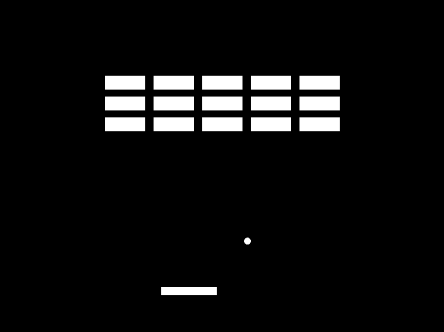

# ash-2dgame-template

<p align="center">
  
</p>

Rustのashを使った2Dゲーム向けのテンプレートコードです。
主にashを使うときのボイラープレートを提供することを目的としています。

以下の機能を実装しています:

- Windows, macOS, Linuxでの動作
- インスタンシング
- テキストレンダリング
- フルスクリーン (アスペクト比固定)

## Next Steps

このリポジトリが実装していない機能として次が挙げられます:

- オーディオ再生
- マウス・コントローラ入力
- セーブ・コンフィグデータ関連

## Build

次を用意してください:

- Git
- Cargo
- Python
- CMake
- Ninja
- MSVC環境 (Windows)
- Xcode CLT (macOS)
- g++ (Linux)
- libxcb (Linux)

次を実行してください:

```sh
# Debugビルド
cargo build

# Releaseビルド
cargo build --release
```

> [!NOTE]
> 依存パッケージのインストールにそれなりの時間がかかります。
> 愚直にclone & buildしているからです。
> Vulkan SDKを使う場合はビルドスクリプトを適宜修正してください。

> [!NOTE]
> Vulkan Validation Layersはデバッグ時かつ`vvl` feature有効時のみ利用できます。
> 1. `cargo build --features vvl`でビルドし、
> 2. `cargo run --features vvl`で実行してください。
