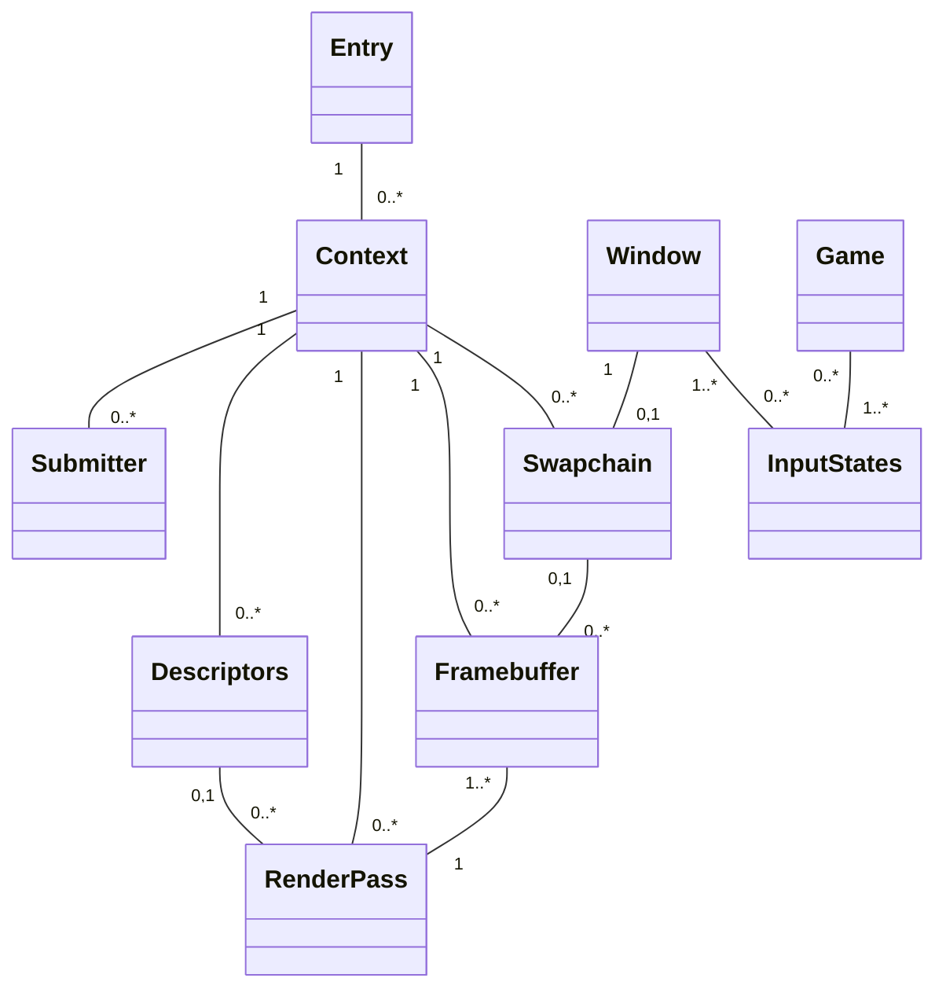

# ash-2dgame-template

## What's this?

Rustのashを使った2Dゲーム向けのテンプレートコードです。

> [!WARNING]
> マルチスレッドに対応していません。
> マルチスレッドで動作させる場合は多くの箇所に修正が必要です。

## Build

次を用意してください:

- Git
- Cargo
- Python
- CMake
- Ninja
- MSVC環境 (Windows)
- Xcode CLT (macOS)

次を実行してください:

```sh
# Debugビルド
cargo build

# Releaseビルド
cargo build --release
```

> [!NOTE]
> 依存パッケージのインストールにそれなりの時間がかかります。

> [!NOTE]
> Vulkan Validation Layersはデバッグ時かつ`vvl` feature有効時のみ利用できます。
> 1. `cargo build --features vvl`でビルドし、
> 2. `cargo run --features vvl`で実行してください。

## Modules


