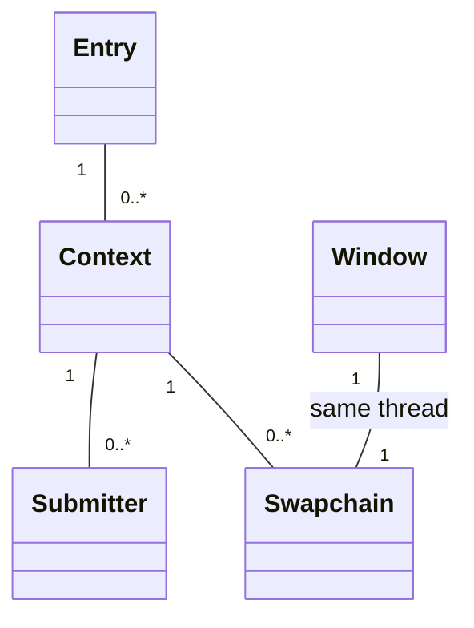

# ash-2dgame-template

## What's this?

Rustのashを使った2Dゲーム向けのテンプレートコードです。

## Build

次を用意してください:

- Cargo
- Conan2あるいはuv
- Ninja
- MSVC環境 (Windows)

次を実行してください:

```
cargo build
```

> [!NOTE]
> デバッグビルド時のみVulkan Validation Layersをインストールします。
> このインストールにはそこそこの時間がかかります。

## Objects


